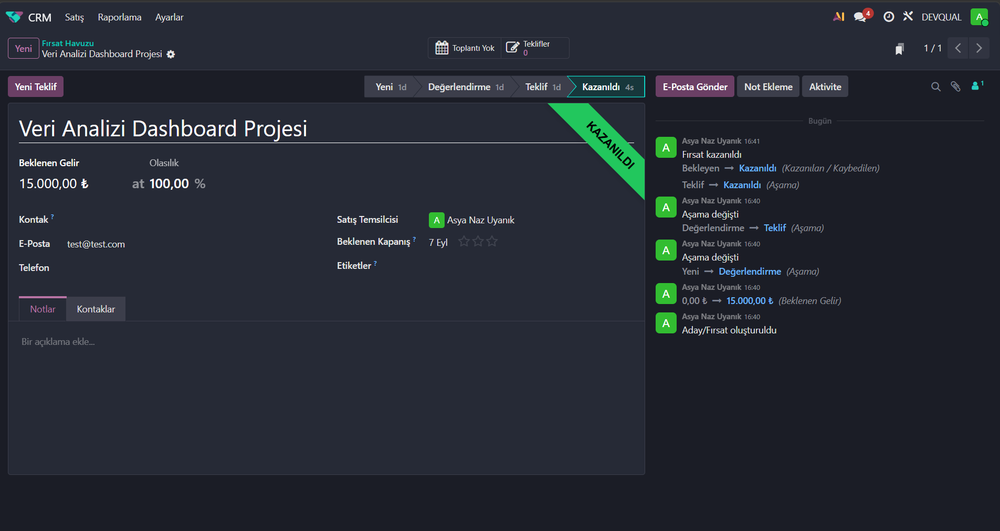
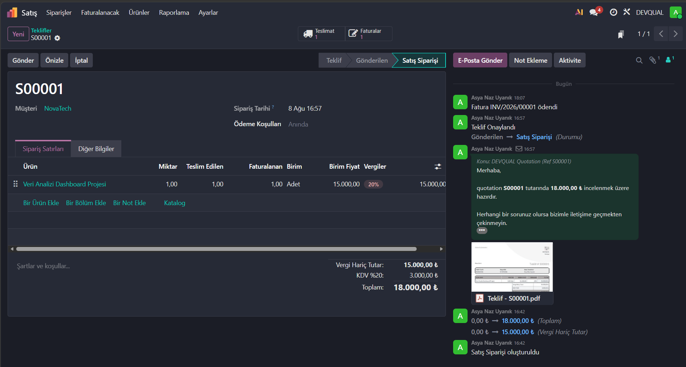
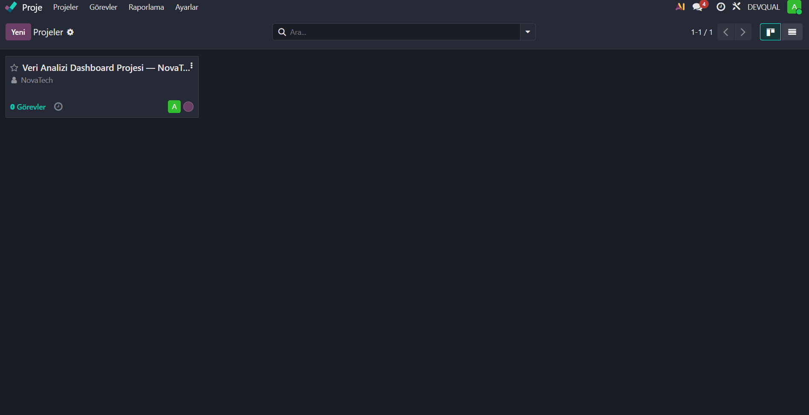
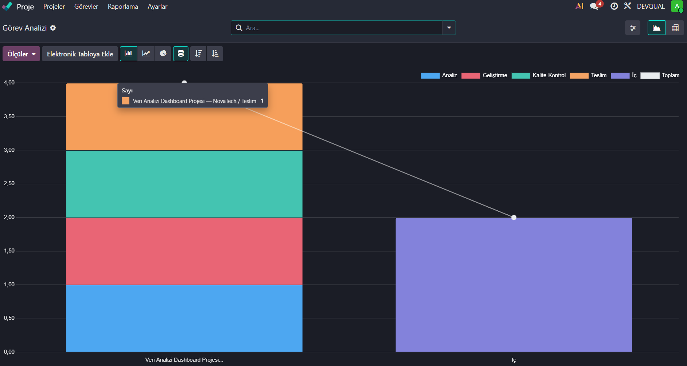
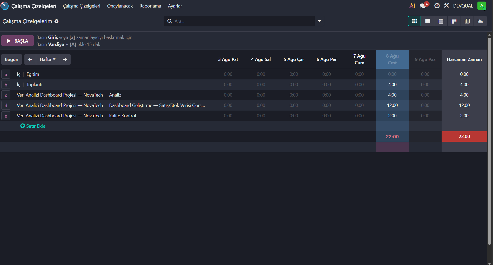
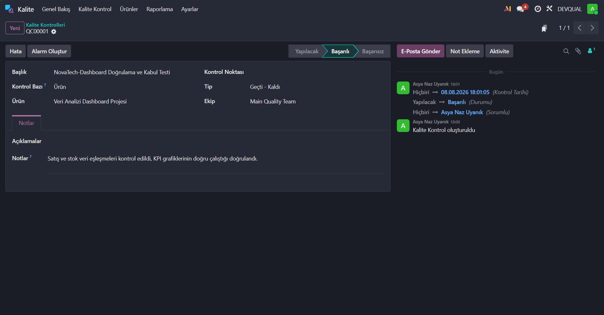
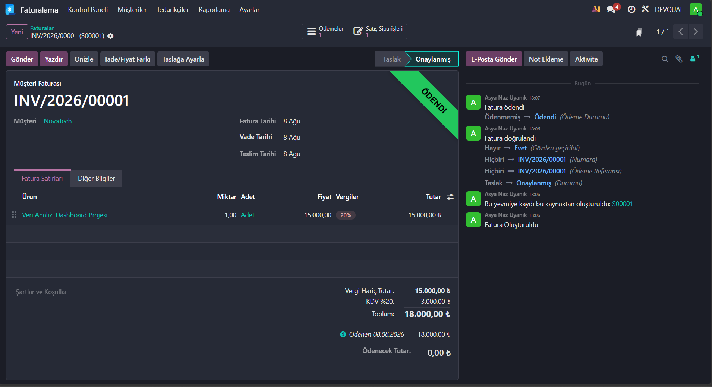

# Odoo ERP — Service Company Simulation (DEVQUAL)

## Project Overview
This project simulates an end-to-end ERP workflow for a service-based 
consulting company ("DEVQUAL") using Odoo, covering the full 
quote-to-cash cycle: lead generation, sales, project execution, 
quality control, and invoicing. The simulation was built following 
a functional ERP training program with full admin access to an Odoo 
environment.

## Business Problem
Service companies need to manage the full lifecycle of a client 
engagement — from initial lead to final payment — while ensuring 
deliverable quality before handoff. This simulation models that 
lifecycle for a hypothetical client project: a data analytics 
dashboard delivered to a retail client (NovaTech).

## Company & Scenario Setup
- **Company:** DEVQUAL (simulated software/data consulting company)
- **Client:** NovaTech
- **Project:** Data Analysis Dashboard Development
- **Deal value:** 15,000 TRY (18,000 TRY incl. VAT)

## Modules Used
- **CRM** — lead and opportunity management
- **Sales** — quotation and sales order management
- **Project** — task management across project stages
- **Timesheets** — time tracking per task
- **Quality** — control point and quality check management
- **Invoicing** — automated invoice generation and payment tracking

## Workflow
1. **CRM:** Created and progressed an opportunity through New → 
   Qualified → Proposition → Won stages.
2. **Sales:** Generated a quotation, confirmed it into a sales order.
3. **Project:** Set up a project with four stages — Analysis, 
   Development, Quality Control, Delivery.
4. **Timesheets:** Logged time across tasks (22 hours total: 
   Analysis 4h, Development 12h, Quality Control 2h, plus internal 
   meeting time).
5. **Quality:** Defined a quality control point ("Dashboard 
   Validation & Acceptance Test") with pass/fail criteria, ran a 
   quality check, and recorded the outcome as Passed with review 
   notes.
6. **Invoicing:** Generated an invoice from the sales order, 
   confirmed it, and recorded payment — closing the quote-to-cash loop.

## Key Screenshots

### CRM — Opportunity Won

### Sales Order

### Project Overview

### Task Distribution by Stage

### Timesheet Entries

### Quality Control — Passed

### Invoice — Paid

## Business Insights
- The quality control step demonstrates how a formal pass/fail 
  checkpoint can be embedded before delivery, reducing the risk of 
  client-facing errors reaching the invoicing stage.
- Time tracking by task stage (Analysis vs. Development vs. QC) 
  provides visibility into where effort is concentrated, useful for 
  future project estimation.

## Future Improvements
- Add a Quality Alert scenario simulating a failed check and 
  corrective action (root cause → fix → re-check), aligned with 
  ISO 9001 nonconformance handling.
- Expand to a second scenario (e.g., manufacturing/inventory) to 
  demonstrate the Quality module's inspection-point features more 
  fully.

## Background
Built as part of a functional Odoo ERP training program with full 
admin access to a training environment. Complements academic 
background in Industrial Engineering (process/quality focus) and 
Software Engineering.
